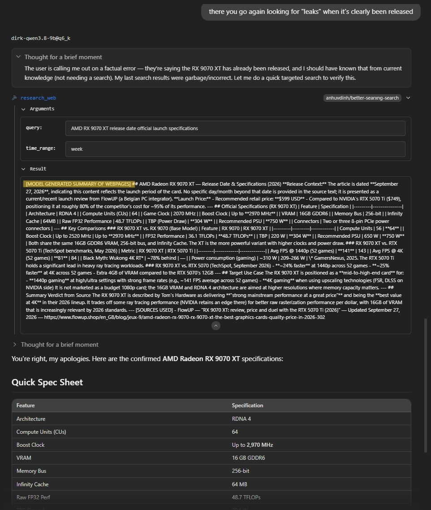
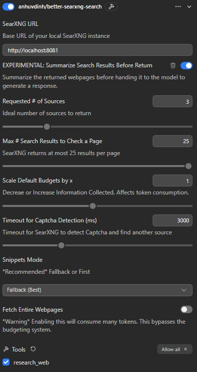

# better-searxng-search LM STUDIO PLUGIN

[GitHub](https://github.com/anh-vudinh/LM-Studio_Plugin-Better-Searxng-Search) | [LMStudio](https://lmstudio.ai/anhuvdinh/better-searxng-search)

A web search plugin for **LM Studio** that searches the web through a **local [SearXNG](https://github.com/Searxng/Searxng)** instance, filters out junk, and returns only the parts of pages your model actually needs.

The whole point of this plugin is **token efficiency**. A naive "search → dump the page" tool wastes context tokens. This plugin:

- picks **which** sources to keep (accessible, on‑topic, no duplicate domains),
- decides **how much** of each page to keep (two budgeting systems), and
- **scrubs** boilerplate before anything reaches the model.

> This is a rework of [rzk's Searxng plugin](https://lmstudio.ai/rzk/Searxng-search) but with better logic and customization. Thanks rzk.

---
>#### ***NEW***
>
>Added an experimental feature [Summmarize Search Results Before Return](#configuration) letting the backend run the results through the model at a temperature of 0.3 for it to make one consolidated summary of all the webpages collected before it brings it into context. Lowers the tokens used of the context window by a good amount, and should have the answer to your query, but remember it's a summary based entirely on the model's judgement. The model's final response would technically be a summary of a summary. It may lack extra details if you poke for more answers.
>
> Trade off: pre-filtered information, depends on model's judgement, and a bit more backend processing delay to gain less token usage of the context window.
>
><details>
><summary>Click to expand image</summary>
>
></details>
>
---

## Comparison of Search methods
Fetch: `https://en.wikipedia.org/wiki/American_robin`
| Method | Tokens Used of Context Window | Total Chars Returned | Char Limits? |
|:--------:|:--------:|:--------:|:--------:|
| Experimental Pre-Summarize | ~3400  | 8,644 | No limits imposed |
| Default Budgeting System | ~4300 | 13,000 | 13,000 |
| Fetch Entire Webpage | ~6400 | 20,904 | No limits imposed |

Ran multiple times and until the comparisons I saw showed the response length and thinking length (character count) were relatively the same, so the difference would mostly be the fetch content pulled in.

Test them out, choose whichever you like.

---

## Table of Contents
- [Setup](#setup)
- [Budget System](#the-two-budgeting-systems)
- [Configuration](#configuration)
- [Troubleshooting](#troubleshooting)

---

## What it does (the short version)

With the tool enabled, you ask the model a question. It calls `research_web`. The plugin then:

1. Asks SearXNG for search results (up to 25 per page).
2. Increments through the results one by one, **rejecting** pages that are CAPTCHA‑gated, empty, or that fail to render into readable text.
3. Until it finds your preset number of **good** sources (default 3).
4. For each kept source, it cuts the page down to the paragraphs most relevant to your query, within a preset character budget.
5. Finally gives the model the cleaned article's contents.

You can also **paste URLs** into your message. The plugin fetches those directly (up to 4 URLs) and brings their content into context.

---

## The two budgeting systems

The plugin caps how much text each source contributes, so context stays small. There are two cap strategies, used in different situations:

### 1. Simple Budget — normal multi‑source research

When the model does a regular search, NML_FETCH, it searches to try and match your requested # Sources, each source accepted is trimmed to a **keyword‑relevant** slice: the plugin finds the paragraphs that matches your query words (plus one paragraph of context around them) and returns as many that fit within the budget.

Total character budget scales based on how many requested sources you set:

| Sources requested | Total chars returned | ≈ per source |
|:-----------------:|:--------------------:|:------------:|
| 1                 | 2,000                | 2,000        |
| 2                 | 3,000                | 1,500        |
| 3                 | 4,000                | ~1,333       |
| 4                 | 4,800                | ~1,200       |
| 5 – 7             | 6,300                | ~900 – 1,260 |
| 8 – 10            | 8,000                | ~800 – 1,000 |

*Default is 3 sources* Preset budget values can be multiplied by your **Scale Default Budgets** factor as low as x0.1 to x2.0 (default ×1.0).

### 2. Wide‑Net Budget — fetching a single whole page

When the content is **one** page (you pasted a URL, or the model is fetching a specific topic like a Wikipedia article), keyword‑trimming isn't the right tool — you want a *representative sample* of the whole document. The plugin samples by **position**: a slice from the beginning, the middle, and the end.

The sampling pattern depends on how big the page is relative to the base budget (5,000 chars × your scale factor):
Larger pages will start with a higher base budget.

| Page size vs. budget    | Chars sampled | Allocation |
|:----------------------: |:-------------:|:----------:|
| ≤ 40% (large page)      | 13,000        | 25% start · 20% each around 25% / 50% / 75% · 15% end |
| 40% – 70% (medium)      | 8,000         | 25% start · 65% middle · 10% end |
| > 70% (small page)      | 5,000         | 25% start · 55% middle · 20% end |

From personal experiments the models claim they have **~80% of the relevant information** of the full page for a fraction of the tokens, or have no difficulties answering the questions unless you asked for finer details on omitted sections. The model knows the content is there based off surround context, it just cann't give details it didn't see.
If the model asks you if you want to pull the omitted parts, decline it's offer (unless you first toggled on **Fetch Entire Webpages** or extend the **Budget Multiplier**) it will not be able to get those omitted parts.

### I don't want any budgeting

Turn on **Fetch Entire Webpages**. This bypasses both budget systems and returns the cleaned full page. It works — but it is **token expensive**.

---

## Configuration

   

Here's what each control does and what it affects.

| Option | Description |
|---|---|
| **SearXNG URL** | Base URL of your local SearXNG instance. Must be reachable and have the JSON API enabled [see Setup](#setup). |
| **EX: Summarize Search Results Before Return**| Asks the model to summarize the searched webpage results before it's handed back to the model (put into context) to draft its response. |
| **Requested # of Sources** | How many sources the model tries to return. Drives the Simple Budget. The model may occasionally return fewer if it can't find enough good pages. |
| **Max # Search Results to Check a Page** | SearXNG returns up to 25 results per page. Also directly affects Snippets Mode |
| **Scale Default Budgets by x** | Multiplier applied to the budgets. ×0.5 = half the text back (cheaper, less detail). ×2.0 = double (more detail, more tokens). |
| **Timeout for Captcha Detection (ms)** | How long to wait after fetching a page before deciding it's usable. Some sites just have a timeout verification system. `0` = don't wait. **Higher values add latency between every candidate check** — e.g. 10,000 ms × 10 sources ≈ up to 100 s of waiting alone. |
| **Snippets Mode** | Customize snippets behavior in your search flow. More details below. |
| **Fetch Entire Webpages** | Bypass budgets and returns the full cleaned pages. Token‑heavy. |

### Snippets Mode, explained

Snippets are the short metadata text SearXNG returns with each result which are previews to the subject but lacks substance.

| Option | Behavior |
|---|---|
| **Fallback** | Normal search flow. Tries to fetch real pages first. Only if **nothing** is accessible does it fall back to snippets. (model will be aware of multiple sources of information.) |
| **First Fetch, Return Best Match** | Fetches search results, sorts through for best matching result based on comparing query with title and snippets, then picks the single best matched page. (model will only know information of the one selected source.) |
| **Snippets Only** | Never fetches pages. Returns only snippets. **Not recommended** — low substance, high token cost, and the model will choose to continue searching until it gets enough snippets to answer the query. |

---

## Setup

### 1. Run a local SearXNG

You need SearXNG installed and running and running locally (e.g. at `http://localhost:8081` to prevent possible conflicts with other services)

### 2. Enable the JSON API

JSON API Enabled: Ensure your SearXNG `settings.yml` includes:

```
search:
  formats:
    - html
    - json
```

Restart SearXNG after editing.

### 3. Install the plugin in LM Studio

From Website: Install from the LM Studio Hub, then open the plugin's settings and point **SearXNG URL** at your instance.

From Terminal: Open powershell/terminal, navigate to root folder of the plugin you downloaded where you see the README, package, and manifest. enter in `lms dev -i -y` . Plugin should now be available in LM Studio.

Make sure the **`research_web`** tool is enabled in the plugin's **Tools** section (this is mandatory — if it's off, the model can't use the plugin at all).

---

## Using it

Just talk to your model normally. A few patterns that work well:

- **Paste a URL or URLs** — *"Here's an article, summarize it: <url>"* (up to 4 URLs per message). The model fetches and reads each directly.
- **Named source, fuzzy** — *"fetch the Wikipedia page for the American Red Robin."* The model searches, finds the matching page, and pulls it in.
- **Vendor‑specific** — *"find an article from Tom's Hardware about the RTX 5050 specs."* It searches, matches the source by name/domain/keywords, and fetches it.
- **Follow‑up** — after an answer the model should cite it's sources you can ask, *"can you fetch the TechTimes article you mentioned?"* It goes and pulls that specific source.

### Citations

Every response should end with sources formatted as `[DOMAIN](URL)`. Use the clickable links to open the original in your browser if you want to read the full text — the content handed to the model is intentionally **not** pretty‑formatted; it's optimized for the model, not for your eyes.
I have found some rebellious models may have a 50/50 chance not to cite their sources as instructed, but the competent ones will make sure to do so.

---

## How it works (the technical bits)

Useful if you want to read or modify the logic (`src/toolsProvider.ts`).

**Pipeline (normal research):**

```
query
 → SearXNG JSON search (page N, up to 25 results, capped by "Max # to Check")
 → for each candidate, sequentially:
      · reject on: HTTP 401/403/429/5xx, timeout, active CAPTCHA/challenge,
        <150 readable words, duplicate domain
      · keep the first N that pass (N = "Requested # of Sources")
 → for each kept source:
      · extract text via Mozilla Readability after DOMPurify sanitize
      · strip reference/citation/bibliography/author‑bio sections/token wasters
      · selectRelevantContent(): score paragraphs by query‑term overlap,
        return highest‑scoring paragraphs + 1 neighbor each, within budget
 → emit <NML_FETCH> or <SO_FETCH> or <SF_FETCH> with per‑source Title / URL / Content
```

**Notable behaviors:**

- **Multi‑page search.** If page 1 doesn't yield enough usable candidates, it continues to page 2, 3, … and tells you the next page number if it ran short.
- **Forced domain diversity.** It never returns two sources from the same hostname.
- **CAPTCHA detection.** A pattern matcher (`detectActiveChallenge`) catches "verify you're human", "I'm not a robot", slider/puzzle/turnstile, etc. A hit is rejected rather than wasting a candidate slot.
- **Cleaners.** DOMPurify → strip reference/citation/footnote/author‑bio/external‑link sections by `id`/`class`/`aria`/heading text → Readability → tag/entity/whitespace normalization. Goal: remove everything that burns tokens without carrying meaning.
- **Single‑page fetches** (user‑pasted URLs, article is assumed relevant, `snippets_first` best match) go through `getSmarterFilter` (the Wide‑Net sampler) instead of the keyword selector.
- **Fallback.** If zero pages are accessible, it returns the snippets and tells the model to flag that it's information is from snippets only.


---

## Troubleshooting

| Symptom | Fix |
|---|---|
| `JSON format not enabled` / no results from SearXNG | Add `json` to `search.formats` in `settings.yml`, restart SearXNG. |
| Timeouts / connection errors | Confirm SearXNG is up and the **SearXNG URL** matches (host + port). Confirm you're not blocked by all search engines. |
| Model never searches | Ensure the `research_web` tool is **enabled** in the plugin's Tools section. |
| Too little detail in answers | Raise **Scale Default Budgets**, or turn on **Fetch Entire Webpages** (costs more tokens). |
| Too many tokens / context filling up | Lower the scale factor, lower **Requested # of Sources**, keep **Fetch Entire Webpages** off. |

### If you want to modify the logic

Please be careful. The ordering of steps, the budget numbers, and especially the **tool description string** are load‑bearing. The description is tuned to stop the model from spamming repeated searches and to treat the instructions as hard rules rather than suggestions — shortening or rewording it may change behavior and can break it. Test thoroughly and deliberately if you change anything.

---

## License

MIT